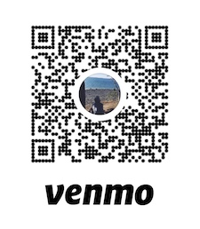

# zoomass.online
UMass Amherst virtual campus multiplayer game, made with Unity 

## Requirements
* [Unity Game Engine](https://unity3d.com/get-unity/download)
* Basic knowledge of Unity and C#, networking, or 3D modelling
* (optional) 3D modelling software, most of the models are from [SketchUp](https://www.sketchup.com/)

## Setup
1. Clone the repository locally

      ```git clone https://github.com/jdnvn/zoomass.online.git```
  
2. Open the Unity Hub and add the project folder
3. Start the project!

## Contributing
Pull requests are welcome. For major changes, please open an issue first to discuss what you would like to change.

## Donate
We would really appreciate any donations. They help keep the game online!


## License
[MIT](https://choosealicense.com/licenses/mit/)

Not affiliated with UMass Amherst
